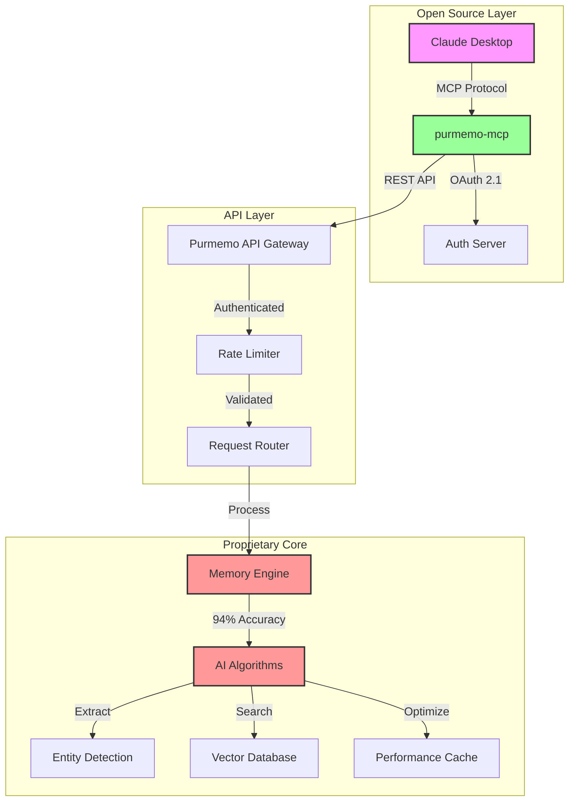

# Purmemo MCP Architecture

## Hybrid Open-Core Model

Purmemo uses a hybrid open-core model that balances open source collaboration with IP protection:

### System Architecture



## Data Flow

### Memory Storage Flow
1. User sends memory via MCP tool
2. MCP server validates and forwards to API
3. API authenticates request
4. Proprietary engine processes:
   - Entity extraction
   - Embedding generation
   - Relationship mapping
   - Indexing
5. Confirmation returned to user

### Memory Retrieval Flow
1. User queries via natural language
2. MCP server forwards to API
3. Proprietary engine:
   - Query understanding
   - Semantic search
   - Ranking algorithm
   - Context assembly
4. Results returned <50ms

## Security Boundaries

### Public (Open Source)
- MCP protocol handlers
- OAuth flow implementation
- API client wrapper
- Error handling
- Logging (non-sensitive)

### Private (Proprietary)
- Memory algorithms
- Entity extraction logic
- Vector search optimization
- Ranking algorithms
- Performance tricks

## Licensing Structure

```yaml
Open Source Components:
  License: MIT
  Location: github.com/coladapo/purmemo-mcp
  Includes:
    - MCP server implementation
    - OAuth client
    - API wrapper
    - Documentation

Proprietary Components:
  License: Proprietary + Patents Pending
  Location: Private repositories
  Includes:
    - Core algorithms
    - AI models
    - Optimization techniques
    - Trade secrets

API Access:
  Terms: Purmemo Terms of Service
  Pricing: Freemium model
  Limits: Rate-limited by tier
```

## Why This Architecture?

### Benefits for Users
- ✅ Can inspect and audit MCP implementation
- ✅ Can contribute improvements
- ✅ Can build custom integrations
- ✅ Assured of no vendor lock-in for protocol

### Benefits for Purmemo
- ✅ Protects core IP and innovations
- ✅ Enables sustainable business model
- ✅ Maintains competitive advantage
- ✅ Allows community contributions

## Deployment

### MCP Server (This Repo)
- Runs locally on user's machine
- Connects to Purmemo API
- Stateless, lightweight
- No data storage

### Purmemo API (SaaS)
- Hosted on secure cloud infrastructure
- Auto-scaling based on load
- Multi-region deployment
- 99.9% uptime SLA

### Proprietary Core (Protected)
- Isolated internal services
- Not directly accessible
- Patent-pending algorithms
- Continuous innovation

## Contributing

Contributions are welcome to the open-source components:
- MCP protocol improvements
- OAuth enhancements
- Documentation
- Bug fixes
- Test coverage

The proprietary core remains closed to protect innovations that make Purmemo unique.