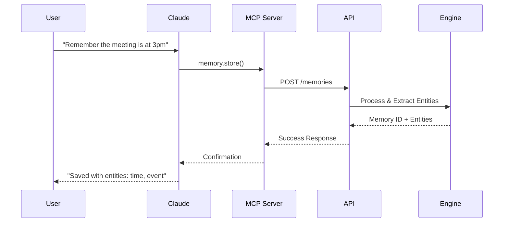
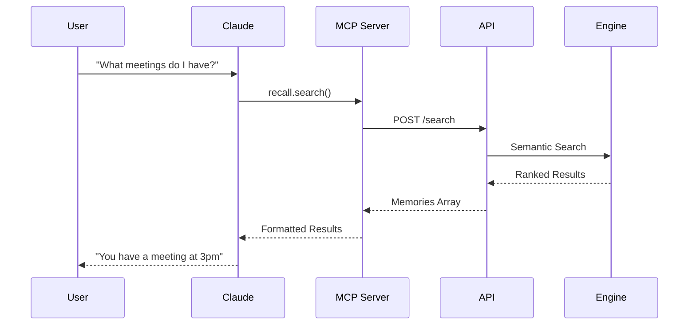

# Purmemo MCP Server Architecture

## Overview

This document explains how the Purmemo MCP server (this repository) interfaces with the Purmemo platform.

## Component Separation

```
┌─────────────────────────────────────────────────────────────┐
│                     Your Local Machine                       │
│                                                              │
│  ┌──────────────┐         ┌──────────────────────┐         │
│  │              │  MCP    │                      │         │
│  │   Claude     │◄────────►│  purmemo-mcp server │         │
│  │   Desktop    │         │    (this repo)       │         │
│  │              │         │                      │         │
│  └──────────────┘         └──────────┬───────────┘         │
│                                       │                     │
└───────────────────────────────────────┼─────────────────────┘
                                        │ HTTPS API
                                        │
                    ┌───────────────────▼────────────────────┐
                    │          Purmemo Cloud API             │
                    │                                         │
                    │  ┌──────────────────────────────────┐ │
                    │  │   Authentication (OAuth 2.1)      │ │
                    │  └──────────────┬───────────────────┘ │
                    │                 │                      │
                    │  ┌──────────────▼───────────────────┐ │
                    │  │      Rate Limiting & Quotas       │ │
                    │  └──────────────┬───────────────────┘ │
                    │                 │                      │
                    │  ┌──────────────▼───────────────────┐ │
                    │  │     Proprietary Memory Engine     │ │
                    │  │   • 94% accuracy algorithms       │ │
                    │  │   • Entity extraction             │ │
                    │  │   • <50ms retrieval               │ │
                    │  │   • Workflow intelligence         │ │
                    │  └──────────────────────────────────┘ │
                    │                                         │
                    └─────────────────────────────────────────┘
```

## How It Works

### 1. Local MCP Server (Open Source)

The MCP server runs locally on your machine and:
- Implements the Model Context Protocol
- Handles communication with Claude Desktop
- Manages OAuth authentication flow
- Forwards requests to Purmemo API
- Returns responses to Claude

**Key Files:**
- `src/server.js` - Main server implementation
- `src/tools/` - MCP tool definitions
- `src/auth/` - OAuth client implementation

### 2. Purmemo API (Documented)

The API provides:
- RESTful endpoints
- Authentication & authorization
- Rate limiting per tier
- Request validation
- Response formatting

**Documentation:** https://api.purmemo.ai/docs

### 3. Proprietary Engine (Trade Secret)

The core engine handles:
- Advanced memory algorithms
- AI processing
- Performance optimization
- Data persistence
- Security

**Note:** This component is not open source and runs on Purmemo's infrastructure.

## Data Flow Examples

### Storing a Memory



### Retrieving Memories



## Security Model

### Authentication Flow

1. **Initial Setup**: User gets API key from dashboard
2. **Configuration**: API key added to Claude config
3. **Runtime**: MCP server includes key in API requests
4. **Validation**: API validates key and enforces quotas

### Data Security

- **In Transit**: TLS 1.3 encryption
- **At Rest**: AES-256 encryption
- **Access Control**: OAuth 2.1 + API keys
- **Audit Logs**: All API access logged

## Performance Considerations

### Local MCP Server
- Minimal overhead (<5ms)
- Stateless operation
- Async/await patterns
- Connection pooling

### API Communication
- HTTPS keep-alive
- Request batching where possible
- Gzip compression
- CDN for static assets

### Response Times
- Memory storage: <100ms
- Memory retrieval: <50ms
- Entity extraction: <200ms
- Batch operations: <500ms

## Development Setup

### Prerequisites

```bash
# Node.js 18+ required
node --version

# Install dependencies
npm install

# Set environment variable
export PURMEMO_API_KEY="your-api-key"
```

### Local Testing

```bash
# Run tests
npm test

# Start development server
npm run dev

# Test with Claude Desktop
npm run test:mcp
```

## Contributing

We welcome contributions to the MCP server! Areas where you can help:

- 🐛 Bug fixes
- 📝 Documentation improvements
- ✨ New MCP features
- 🧪 Test coverage
- 🌍 Internationalization

**Note:** Core algorithm improvements should be suggested via support@purmemo.ai as they involve proprietary code.

## Support

- **Documentation**: https://docs.purmemo.ai
- **API Reference**: https://api.purmemo.ai/docs
- **Discord**: https://discord.gg/purmemo
- **Email**: support@purmemo.ai

---

*This architecture ensures Purmemo can maintain its innovative edge while fostering an open ecosystem around the MCP protocol.*