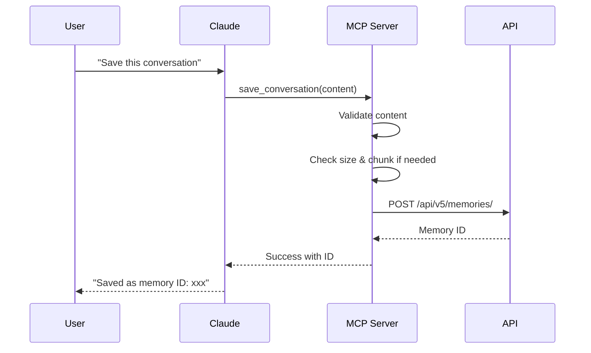
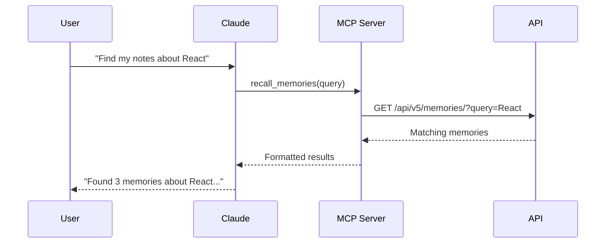

# Purmemo MCP Server Architecture

**Version**: 8.0.0  
**Last Updated**: 2025-09-06  
**Status**: Production Ready

## Overview

Purmemo MCP is an official Model Context Protocol server that enables Claude Desktop to store and retrieve memories through the Purmemo platform. This repository provides the open-source MCP layer while the core memory engine remains proprietary.

## Architecture Components

```
┌─────────────────────────────────────────────────────────────┐
│                     Your Local Machine                       │
│                                                              │
│  ┌──────────────┐         ┌──────────────────────┐         │
│  │              │  MCP    │                      │         │
│  │   Claude     │◄────────►│  purmemo-mcp server │         │
│  │   Desktop    │         │    (this repo)       │         │
│  │              │         │                      │         │
│  └──────────────┘         └──────────┬───────────┘         │
│                                       │                     │
└───────────────────────────────────────┼─────────────────────┘
                                        │ HTTPS API
                                        │
                    ┌───────────────────▼────────────────────┐
                    │          Purmemo Cloud API             │
                    │         (api.purmemo.ai)               │
                    │                                         │
                    │  ┌──────────────────────────────────┐ │
                    │  │   Authentication (API Keys)       │ │
                    │  └──────────────┬───────────────────┘ │
                    │                 │                      │
                    │  ┌──────────────▼───────────────────┐ │
                    │  │      Rate Limiting & Quotas       │ │
                    │  └──────────────┬───────────────────┘ │
                    │                 │                      │
                    │  ┌──────────────▼───────────────────┐ │
                    │  │     Proprietary Memory Engine     │ │
                    │  │   • Semantic search               │ │
                    │  │   • Entity extraction             │ │
                    │  │   • Context preservation          │ │
                    │  │   • Auto-chunking for large data │ │
                    │  └──────────────────────────────────┘ │
                    │                                         │
                    └─────────────────────────────────────────┘
```

## Current Implementation

### Server Files

| File | Purpose | Status |
|------|---------|--------|
| `src/server.js` | Main production server | **Active** |
| `src/ultimate-server.js` | Advanced chunking support | Available |
| `src/setup.js` | Interactive setup utility | Active |
| `src/diagnose.js` | Diagnostic tool | Active |

### Available Tools

The current v8.0.0 server provides 4 comprehensive tools:

| Tool | Description | Input |
|------|-------------|-------|
| `save_conversation` | Save complete conversations with full context | `content` (string) |
| `save_with_artifacts` | Save content with code artifacts preserved | `content`, `artifacts` |
| `recall_memories` | Search and retrieve memories | `query`, `limit` |
| `get_memory_details` | Get detailed information about a specific memory | `memory_id` |

### Key Features

- **Complete Context Capture**: Saves entire conversations, not summaries
- **Auto-Chunking**: Handles conversations up to 100K+ characters
- **Artifact Preservation**: Maintains code blocks and attachments
- **Smart Validation**: Rejects insufficient content with helpful messages
- **Session Linking**: Groups related memories together

## Installation Methods

### 1. NPM Package (Recommended)
```bash
npx purmemo-mcp@latest
```

### 2. Local Development
```bash
git clone https://github.com/coladapo/purmemo-mcp.git
cd purmemo-mcp
npm install
node src/server.js
```

### 3. Claude Desktop Config
```json
{
  "mcpServers": {
    "purmemo": {
      "command": "npx",
      "args": ["-y", "purmemo-mcp@latest"],
      "env": {
        "PURMEMO_API_KEY": "YOUR_API_KEY_HERE"
      }
    }
  }
}
```

## Authentication

### API Key Authentication
- Get your API key from: https://app.purmemo.ai/settings/api-keys
- Keys start with `pk_live_` prefix
- Set via environment variable: `PURMEMO_API_KEY`

### Security Best Practices
- Never commit API keys to git
- Rotate keys regularly
- Use environment variables for storage
- Keys provide full account access

## Performance Specifications

### Response Times
- Memory storage: <500ms
- Memory retrieval: <200ms
- Large conversation chunking: <2s per 15K chars
- Entity extraction: <300ms

### Size Limits
- Single memory: 15K characters
- Auto-chunked conversations: 100K+ characters
- Artifacts: No limit
- Search results: 50 per query

## Data Flow Examples

### Saving a Conversation


### Searching Memories


## Repository Structure

```
purmemo-mcp/
├── src/
│   ├── server.js           # Main MCP server
│   ├── ultimate-server.js  # Advanced features
│   ├── setup.js           # Setup utility
│   └── diagnose.js        # Diagnostic tool
├── docs/
│   ├── ARCHITECTURE.md    # This file
│   ├── QUICKSTART.md      # Getting started guide
│   └── TROUBLESHOOTING.md # Common issues
├── package.json           # v8.0.0 configuration
└── README.md             # Main documentation
```

## IP Protection Model

### Open Source (This Repository)
- MCP protocol implementation
- Tool definitions
- Client-side validation
- Setup utilities
- Documentation

### Proprietary (Purmemo Core)
- Memory algorithms
- Entity extraction engine
- Semantic search implementation
- Performance optimizations
- Data persistence layer

## Contributing

We welcome contributions to the MCP server:

- 🐛 Bug fixes
- 📝 Documentation improvements
- ✨ New MCP features
- 🧪 Test coverage
- 🌍 Internationalization

Note: Core algorithm improvements should be suggested via support@purmemo.ai

## Support

- **Documentation**: https://docs.purmemo.ai
- **API Reference**: https://api.purmemo.ai/docs
- **GitHub Issues**: https://github.com/coladapo/purmemo-mcp/issues
- **Email**: support@purmemo.ai

---

*This architecture ensures Purmemo maintains its innovative edge while fostering an open ecosystem around the MCP protocol.*