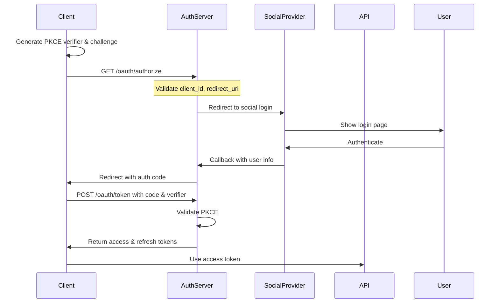

# Unified OAuth Architecture for Purmemo Platform

## Executive Summary

Based on comprehensive research of OAuth 2.1, PKCE, Claude MCP, ChatGPT plugins, NPM packages, and social OAuth providers, this document presents a production-ready unified authentication architecture that supports all your use cases.

## Key Findings from Research

### 1. OAuth 2.1 & PKCE Requirements
- **Mandatory PKCE** for all clients (even confidential ones)
- **No Implicit Flow** - only Authorization Code flow with PKCE
- **Exact redirect URI matching** - no wildcards
- **Refresh token rotation** for enhanced security
- **Minimum 43-character code verifiers** with SHA-256 challenges

### 2. Claude MCP Authentication
- MCP supports remote servers with OAuth authorization
- Requires server metadata discovery
- Supports both local and remote MCP servers
- Authentication context passed through to MCP tools
- Best practice: Use bearer tokens with proper scoping

### 3. ChatGPT Custom GPT Requirements
- Supports OAuth 2.0 with client credentials
- Requires explicit Authorization URL endpoint
- Must redirect back to: `https://chat.openai.com/aip/plugin-{PLUGIN_ID}/oauth/callback`
- Token verification endpoint required
- Mobile vs Web authentication differences exist

### 4. NPM Package Best Practices
- Support both environment variables and config files
- Implement token caching with secure storage
- Provide CLI authentication flow
- Support multiple authentication methods (OAuth, API keys)
- Use established libraries like `google-auth-library` patterns

### 5. Social OAuth (Google/GitHub)
- Google requires `access_type: 'offline'` for refresh tokens
- GitHub OAuth apps vs GitHub Apps have different flows
- Both support PKCE (recommended even if not required)
- Scope management critical for least privilege

## Unified Architecture Design

### Core Components

```
┌─────────────────────────────────────────────────────────────┐
│                     Purmemo Auth Service                      │
├─────────────────────────────────────────────────────────────┤
│                                                               │
│  ┌──────────────────────────────────────────────────────┐   │
│  │              OAuth 2.1 Authorization Server           │   │
│  │                                                       │   │
│  │  • /oauth/authorize  (Authorization Endpoint)         │   │
│  │  • /oauth/token      (Token Endpoint)                 │   │
│  │  • /oauth/userinfo   (UserInfo Endpoint)             │   │
│  │  • /oauth/revoke     (Revocation Endpoint)            │   │
│  │  • /.well-known/openid-configuration                  │   │
│  └──────────────────────────────────────────────────────┘   │
│                                                               │
│  ┌──────────────────────────────────────────────────────┐   │
│  │                  Client Registry                      │   │
│  │                                                       │   │
│  │  Registered Clients:                                  │   │
│  │  • claude-mcp      (MCP integration)                  │   │
│  │  • chatgpt-plugin (ChatGPT Custom GPT)                │   │
│  │  • npm-cli        (NPM package CLI)                   │   │
│  │  • web-app        (Web application)                   │   │
│  │  • mobile-app     (Mobile applications)               │   │
│  │  • api-client     (Direct API access)                 │   │
│  └──────────────────────────────────────────────────────┘   │
│                                                               │
│  ┌──────────────────────────────────────────────────────┐   │
│  │              Social Provider Integration              │   │
│  │                                                       │   │
│  │  • Google OAuth 2.0 (with refresh tokens)             │   │
│  │  • GitHub OAuth 2.0                                   │   │
│  │  • Email/Password (fallback)                          │   │
│  └──────────────────────────────────────────────────────┘   │
│                                                               │
│  ┌──────────────────────────────────────────────────────┐   │
│  │                  Token Management                     │   │
│  │                                                       │   │
│  │  • JWT Access Tokens (1 hour expiry)                  │   │
│  │  • Refresh Tokens (30 days, rotating)                 │   │
│  │  • API Keys (legacy support)                          │   │
│  │  • PKCE verification                                   │   │
│  └──────────────────────────────────────────────────────┘   │
└─────────────────────────────────────────────────────────────┘
```

### Authentication Flows

#### 1. Universal OAuth Flow (All Clients)



#### 2. Client-Specific Implementations

##### Claude MCP
```javascript
// MCP server configuration
{
  "mcpServers": {
    "purmemo": {
      "command": "npx",
      "args": ["purmemo-mcp"],
      "env": {
        "PURMEMO_CLIENT_ID": "claude-mcp"
      }
    }
  }
}
```

##### ChatGPT Custom GPT
```yaml
openapi: 3.0.0
servers:
  - url: https://api.purmemo.ai
components:
  securitySchemes:
    OAuth2:
      type: oauth2
      flows:
        authorizationCode:
          authorizationUrl: https://api.purmemo.ai/oauth/authorize
          tokenUrl: https://api.purmemo.ai/oauth/token
          scopes:
            memories.read: Read memories
            memories.write: Write memories
```

##### NPM Package
```javascript
// Automatic authentication with fallbacks
class PurmemoAuth {
  async authenticate() {
    // 1. Check for existing token
    if (await this.hasValidToken()) return this.token;
    
    // 2. Try refresh token
    if (this.refreshToken) {
      return await this.refreshAccessToken();
    }
    
    // 3. Check environment variable
    if (process.env.PURMEMO_API_KEY) {
      return process.env.PURMEMO_API_KEY;
    }
    
    // 4. Start OAuth flow
    return await this.startOAuthFlow();
  }
}
```

### Database Schema

```sql
-- OAuth Clients
CREATE TABLE oauth_clients (
  id UUID PRIMARY KEY DEFAULT gen_random_uuid(),
  client_id VARCHAR(255) UNIQUE NOT NULL,
  client_secret VARCHAR(255),
  client_name VARCHAR(255) NOT NULL,
  client_type VARCHAR(50) NOT NULL, -- 'public' or 'confidential'
  redirect_uris TEXT[] NOT NULL,
  allowed_scopes TEXT[] NOT NULL,
  created_at TIMESTAMPTZ DEFAULT NOW()
);

-- OAuth Sessions (for PKCE)
CREATE TABLE oauth_sessions (
  id UUID PRIMARY KEY DEFAULT gen_random_uuid(),
  session_id VARCHAR(255) UNIQUE NOT NULL,
  client_id VARCHAR(255) NOT NULL,
  code_challenge VARCHAR(255),
  code_challenge_method VARCHAR(10),
  state VARCHAR(255),
  redirect_uri TEXT NOT NULL,
  expires_at TIMESTAMPTZ NOT NULL,
  created_at TIMESTAMPTZ DEFAULT NOW()
);

-- OAuth Codes
CREATE TABLE oauth_codes (
  id UUID PRIMARY KEY DEFAULT gen_random_uuid(),
  code VARCHAR(255) UNIQUE NOT NULL,
  client_id VARCHAR(255) NOT NULL,
  user_id UUID NOT NULL,
  redirect_uri TEXT NOT NULL,
  code_challenge VARCHAR(255),
  scope TEXT,
  expires_at TIMESTAMPTZ NOT NULL,
  created_at TIMESTAMPTZ DEFAULT NOW()
);

-- Refresh Tokens
CREATE TABLE refresh_tokens (
  id UUID PRIMARY KEY DEFAULT gen_random_uuid(),
  token VARCHAR(255) UNIQUE NOT NULL,
  user_id UUID NOT NULL,
  client_id VARCHAR(255) NOT NULL,
  scope TEXT,
  expires_at TIMESTAMPTZ NOT NULL,
  created_at TIMESTAMPTZ DEFAULT NOW(),
  rotated_from UUID REFERENCES refresh_tokens(id)
);
```

### Implementation Roadmap

#### Phase 1: Core OAuth Server (Week 1)
- [ ] Implement OAuth 2.1 authorization server
- [ ] Add PKCE support for all flows
- [ ] Create client registry system
- [ ] Implement token management

#### Phase 2: Client Integrations (Week 2)
- [ ] Claude MCP authentication
- [ ] ChatGPT plugin OAuth
- [ ] NPM package authentication
- [ ] Web app integration

#### Phase 3: Social Providers (Week 3)
- [ ] Google OAuth integration
- [ ] GitHub OAuth integration
- [ ] Email/password fallback
- [ ] Account linking

#### Phase 4: Security & Polish (Week 4)
- [ ] Refresh token rotation
- [ ] Rate limiting
- [ ] Audit logging
- [ ] Documentation

## Security Considerations

1. **PKCE Mandatory**: All clients must use PKCE, even confidential ones
2. **Exact URI Matching**: No wildcard redirects allowed
3. **Token Rotation**: Refresh tokens rotate on each use
4. **Secure Storage**: Tokens encrypted at rest
5. **Rate Limiting**: Prevent brute force attacks
6. **Audit Logging**: Track all authentication events
7. **HTTPS Only**: No HTTP allowed in production
8. **CORS Policy**: Strict origin checking

## Migration Strategy

### Current State Issues
- OAuth callback chain broken (frontend doesn't complete redirect)
- Multiple client_id confusion (chatgpt-purmemo vs claude-purmemo)
- No unified authentication system
- Manual token extraction required

### Migration Steps
1. Deploy new OAuth server alongside existing
2. Register all client types
3. Update frontend callback handler
4. Migrate existing users' refresh tokens
5. Deprecate old endpoints
6. Remove legacy code

## Testing Strategy

### Unit Tests
- PKCE generation and validation
- Token generation and validation
- Client authentication
- Scope validation

### Integration Tests
- Full OAuth flow for each client type
- Social provider integration
- Token refresh flow
- Error scenarios

### End-to-End Tests
- Claude MCP authentication
- ChatGPT plugin flow
- NPM package installation and auth
- Mobile app authentication

## Monitoring & Observability

- Authentication success/failure rates
- Token refresh patterns
- Client usage statistics
- Error tracking
- Performance metrics

## Documentation Requirements

### For Developers
- OAuth flow diagrams
- Client registration guide
- API documentation
- SDK usage examples

### For Users
- Setup guides per platform
- Troubleshooting guide
- Security best practices
- FAQ

## Conclusion

This unified OAuth architecture addresses all identified issues:
- ✅ Supports all client types (Claude, ChatGPT, NPM, etc.)
- ✅ Implements OAuth 2.1 with mandatory PKCE
- ✅ Fixes broken callback chains
- ✅ Provides multiple authentication methods
- ✅ Ensures security best practices
- ✅ Scales for future growth

The implementation prioritizes security, user experience, and maintainability while supporting the diverse authentication needs of the Purmemo platform.