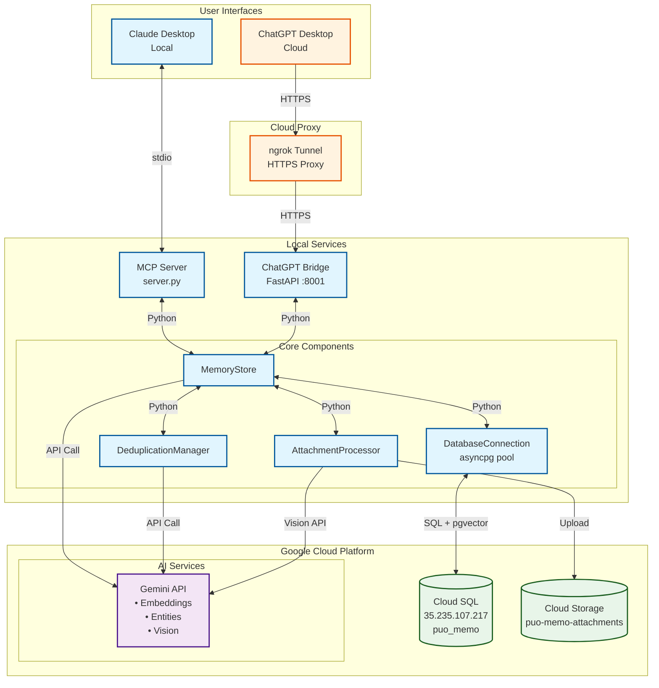

# PUO Memo Architecture - Visual Diagram



## Processing Flow Details

### 🧠 Where Intelligence Happens:

| Process | Location | Details |
|---------|----------|---------|
| **Embedding Generation** | Gemini API (Cloud) | Text → 768-dim vectors |
| **Entity Extraction** | Gemini API (Cloud) | NER + relationship extraction |
| **Similarity Search** | Cloud SQL (pgvector) | Cosine similarity in DB |
| **Vision Analysis** | Gemini API (Cloud) | Image/PDF understanding |
| **Content Deduplication** | Cloud SQL + Local | 90% similarity threshold |

### 📊 Data Flow Examples:

#### Creating a Memory:
```
1. User types in Claude/ChatGPT
2. Local server receives content
3. Calls Gemini API for embedding (Cloud)
4. Calls Gemini API for entities (Cloud)
5. Stores in Cloud SQL with vector
6. Returns memory ID to user
```

#### Searching Memories:
```
1. User enters search query
2. Local server gets query
3. Calls Gemini API for query embedding (Cloud)
4. Cloud SQL does vector similarity search
5. Returns ranked results
6. Local server formats response
```

#### Attaching Files:
```
1. User provides file path/URL
2. Local validation
3. Upload to Google Cloud Storage
4. Gemini Vision API analyzes content
5. Metadata + analysis stored in Cloud SQL
```

### 🔐 Security Boundaries:

- **Claude**: Direct local access (trusted)
- **ChatGPT**: Through ngrok tunnel (authenticated)
- **Gemini API**: API key authentication
- **Cloud SQL**: Database credentials
- **GCS**: Service account or API key

### 💾 Storage Distribution:

| Data Type | Location | Why |
|-----------|----------|-----|
| Memory Content | Cloud SQL | Centralized, backed up |
| Embeddings | Cloud SQL (pgvector) | Efficient similarity search |
| Knowledge Graph | Cloud SQL | Relational queries |
| File Attachments | Google Cloud Storage | Scalable blob storage |
| Logs | Local disk | Debugging, temporary |

The intelligence (AI processing) happens entirely in the cloud via Gemini API, while the orchestration and business logic run locally. Your data is stored in Google Cloud for reliability and accessibility.